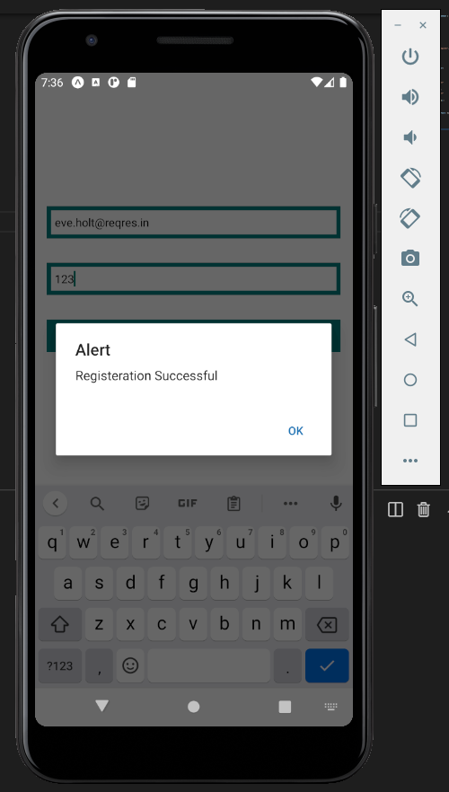
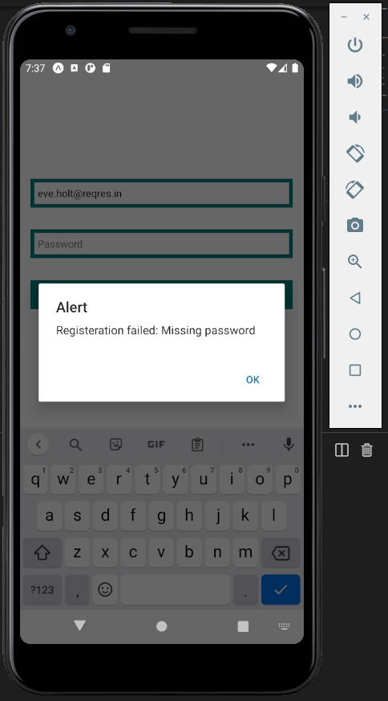
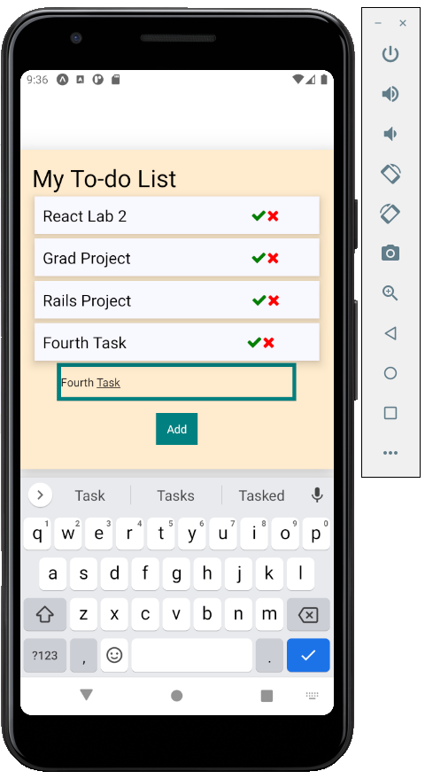
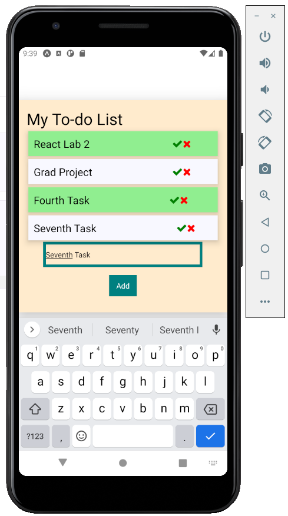
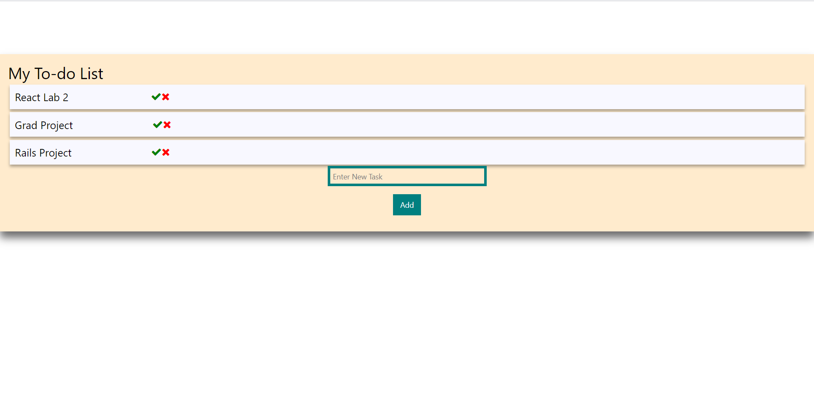

# React_Native Lab

## Registeration to reqres.in API

### Register successfully

### Register Failed

## To-Do List

### added task with title "Fourth Task"

### removed task with title "Rails Project" and selected "React Lab2" and "Fourth Task" as done

### to-do web view

